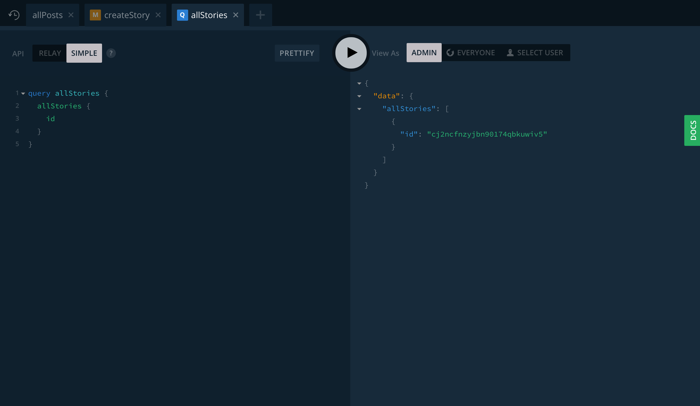
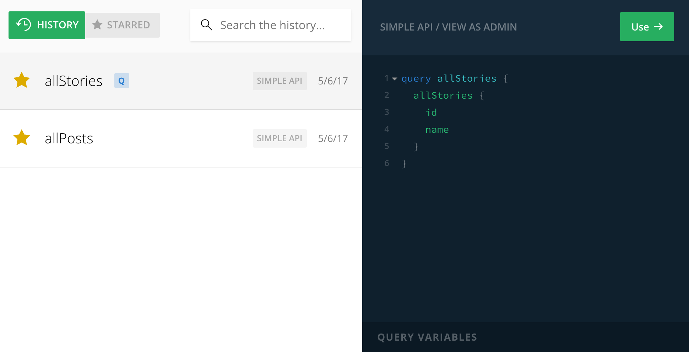

# Console

The [Graphcool Console](http://console.graph.cool) provides a wide range of possibilities to manage your GraphQL projects. Apart from [different project settings](#project-setttings), many powerful features are available:

* The [Schema Editor](#schema-editor) gives you an overview of your GraphQL schema and allows you to do [schema migrations](!alias-paesahku9t) either visually or on a textual basis.

* In the [Data Browser](#data-browser) you can view the stored data for the different model [types](!alias-eiroozae8u#graphql-types) in your GraphQL backend and modify or create new data.

* In the [Permission View](#permissions-view) you can view and modify [permissions](!alias-iegoo0heez) for operations based on [types](!alias-eiroozae8u#graphql-types) and [relations](!alias-eiroozae8u#relations) in your schema

* The [Functions View](!alias-ejamaid4ae) gives an overview over existing [functions](!alias-boo6uteemo), including most recent invocations and a detailed execution log

* In the [Playground](!alias-oe1ier4iej), you can explore and execute all GraphQL queries, mutations and subscriptions available in your [GraphQL API](!alias-heshoov3ai).

* The Integrations View allows you to enable or disable the available [integrations](!alias-seimeish6e) and configure their credentials.

<InfoBox type=warning>

Notice most of the features on this page only are available for [non-ejected](!alias-opheidaix3#non-ejected-projects) projects.

Ejected projects just have read-only access to the Data Browser and Function logs.

</InfoBox>

## Projects

Apps you are building with Graphcool are organized into different projects. A project consists of a [data schema](!alias-ahwoh2fohj), the data itself and other components like [integrations](!alias-seimeish6e) or [permissions](!alias-iegoo0heez).

More options to manage your project can be found in the [project settings](!alias-aechi6iequ).

### Project Endpoints

A project offers different [API](!alias-heshoov3ai) endpoints that all contain the project id.

### Managing projects

By clicking the arrow next to the active project's name, you can expand the project list to get an overview of all your existing projects.

Click the plus button to create new projects. The schema of a new project will be populated with the existing [system types](!alias-uhieg2shio).

### Project names and aliases

Project names can contain **alphanumeric characters and spaces** and need to start with an uppercase letter. They can contain **at most 64 characters**.

*Project names are unique on an account level.*

Project aliases can contain **lowercase letters and dashes**.

*Project aliaes are globally unique.*

##### Examples

Valid project names:

* `My Project`
* `MyProject2`
* `MY PROJECT`

Valid project aliases:

* `my-project`
* `my-project-dev`
* `myproject`

## Project Settings

### General information

Here you can configure and view general settings for your project.

* The **project name** helps you to manage your different projects, but has no other effect.
* The **project id** is automatically generated and not customizable. It can be found in your API [endpoints](!alias-yahph3foch#project-endpoints) as well.
* If you want to customize your API endpoints, you can set a custom **project alias**. Now you can use either the project id or project alias when using the project API or working with the [CLI](!alias-kie1quohli).
* You can also **clone your project** and decide to optionally include data or other project settings.

In the **danger zone** you can delete your projects data, schema, or delete your project all together. **These actions are not reversible**.

### Other settings

In the **authentication** tab, you can create and manage [permanent access tokens](!alias-eip7ahqu5o). These are mainly used in serverless functions or other server-side code that needs full access to your API.

The **export** tab allows you to export your data as JSON files and download your schema. You can also use [get-graphql-schema](https://github.com/graphcool/get-graphql-schema) to download your schema for advanced uses.

Monthly usage is collected in the **billing** tab. This gives you insight into your monthly requests and data storage and allows you to upgrade your plan.

> Currently, only the owner of a project has access to the billing tab. Please reach out to us if you need to transfer ownership of one of your projects!

The **team** tab allows you to view your collaborators and manage seats if you're the owner of the project.

## Schema Editor

The **Schema Editor** allows you to work with your project's [data schema](!alias-ahwoh2fohj) and evolve it using [schema migrations](!alias-paesahku9t). You can either use the left side to change your schema on a textual basis or use the right side to change your schema with the UI.

An integration with [graphql-voyager](https://github.com/APIs-guru/graphql-voyager/) is available with the Graph View button. You can use it to explore your schema visually.

> More information about elements in the schema file can be found in the [schema](!alias-ahwoh2fohj) chapter while changes to the schema are described in the [schema migrations](!alias-paesahku9t) chapter.

## Data Browser

In the **Data Browser** you can get an overview of the data for the different [types](!alias-ij2choozae) and [relations](!alias-goh5uthoc1) in your schema. Here you have the chance to create new data, or update or delete existing data.

New nodes for [system types](!alias-uhieg2shio) can't be created in the Data View.

> You can upload files to your project by drag-and-dropping them on the Data Browser.

## Permissions View

The **Permission View** gives you access to all the defined [permissions](!alias-iegoo0heez) for your project and allows you to create and modify them.

### Permission list

All existing permissions are listed in the Permission View. They are grouped into **type and relation permissions**.

#### Type permissions

Type permissions are associated to a specific [type](!alias-ij2choozae) in your project. The permission list contains various information for each type permission:

* whether the permission is applicable to **everyone or only authenticated users**
* the CRUD operation the permission is associated with - this can be either a query or a create, delete or update mutation in your [GraphQL API](!alias-heshoov3ai).
* the **fields the permission is applicable to**.

#### Relations permissions

A relation permission is associated to a [relation](!alias-goh5uthoc1) in your project and can be applicable to **connecting or disconnecting operations for that relation, or both**.

> More information can be found in the [permissions](!alias-iegoo0heez) chapter.

## Functions View

The **Functions View** contains all the [functions](!alias-boo6uteemo) for your project and allows you to create, modify and test them.

### Information in the function list

All your functions are listed in the Functions View. Here you can see several information about your functions:

* the **unique function name** acts as an identifier
* the **event type of a function** determines when it is invocated
* **the recent invocations of each function** give you a quick overview of recent executions
* **the function logs** give you detailed insights into past function invocations

> More information about functions and how the different event type work can be found in the [functions](!alias-boo6uteemo) chapter.

### Working with functions

* To create a new function, choose a name and event type and select one of the available triggers for the selected event type. You will be guided through the process of either entering an [inline or remote function](!alias-hohl0iy1ji).

* To change the code for a function or delete it all together, you can open the function popup by selecting the function in the list.

* For testing and debugging purposes you can use the **Test Run** option in the function popup. This allows you to directly execute functions, circumventing the usual trigger event.

## Playground

The GraphQL **Playground** lets you explore the [GraphQL API](!alias-heshoov3ai) of your project and run queries, mutations and even subscriptions. It is based on the open source tool [GraphiQL](https://github.com/graphql/graphiql) by Facebook.

### Running GraphQL operations

The main feature of the GraphQL Playground is **running queries, mutations and subscriptions**. It also comes with autocompletion against your GraphQL schema:

When executing a subscription, you will  **receive subscription events right in the Playground**! You can combine this with executing mutations in another Playground tab to test how subscriptions and mutations interact.

> All GraphQL operations support the use of [GraphQL Variables](!alias-thaexex7av). Simply declare them in the query editor and supply the desired values in the query variables input field.

### Advanced Features

### History log and tabs

If you need to run a lot of different GraphQL operations, you can simply add new tabs

#### Selecting API Endpoint

For each tab, you can choose to run queries to the [Simple or Relay API](!alias-heshoov3ai).

#### Authenticating as a user

In the Playground you can choose to run GraphQL operations either as `ADMIN` (all operations are allowed), `EVERYONE` or a specific user.
